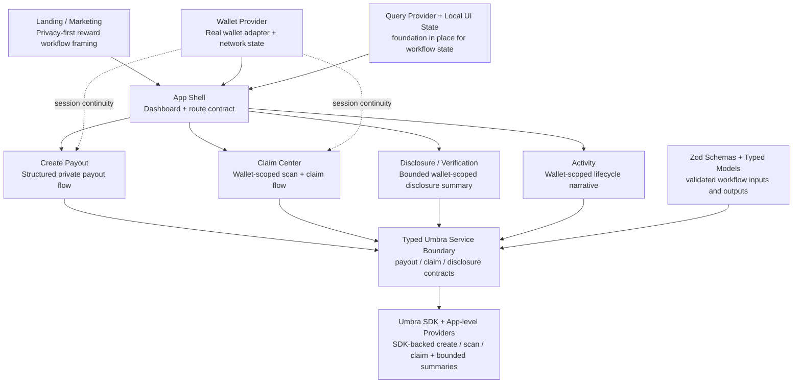

# ARCHITECTURE_DIAGRAM.md

## Goal

Provide a submission-friendly architecture diagram source for `Umbra Bounty Vault` that stays aligned with the current repository scope.

This diagram is intentionally scoped to the current implementation:

- product-grade reward workflow
- real wallet adapter entry with wallet-scoped session continuity
- Umbra SDK-centered typed service boundary
- bounded disclosure and activity narrative surfaces

It should not be read as a claim of full live Umbra protocol integration or one shared live on-chain payout context across every page.

---

## Diagram (Mermaid)

---

## Reading Guide

Use this reading order when presenting the diagram:

1. `Landing` frames the problem as privacy-first reward distribution.
2. `App Shell` holds the route contract across dashboard and app surfaces.
3. `Create Payout`, `Claim Center`, `Disclosure`, and `Activity` express the main product lifecycle.
4. `Wallet Provider` supplies the real wallet adapter entry, network state, and wallet-scoped session continuity where the current flow uses it.
5. `Typed Umbra Service Boundary` keeps payout, claim, and disclosure semantics behind app-layer contracts.
6. `Umbra SDK + App-level Providers` represents the current integration boundary: SDK-backed create/scan/claim plus bounded disclosure/activity summaries.

---

## Presenter Notes

### What to emphasize

- this is a workflow diagram, not a low-level protocol topology
- Umbra is presented as product infrastructure for reward distribution
- the strongest narrative is create -> claim -> disclosure -> activity
- typed boundaries and bounded narrative surfaces are deliberate, not accidental

### What to avoid

Avoid saying:

- this is the final production architecture
- this is a full live Umbra integration map
- every page is driven by one shared live payout context
- the disclosure layer is a complete audit or compliance system

### Honest scope note

If asked about implementation scope, say:

- the current repository demonstrates a bounded workflow architecture
- the wallet layer starts from a real wallet adapter path, while wallet-scoped session continuity keeps the broader lifecycle coherent
- the service boundary is typed and centered on SDK-backed create / scan / claim flows
- disclosure and activity remain bounded wallet-scoped summary surfaces in the current implementation
